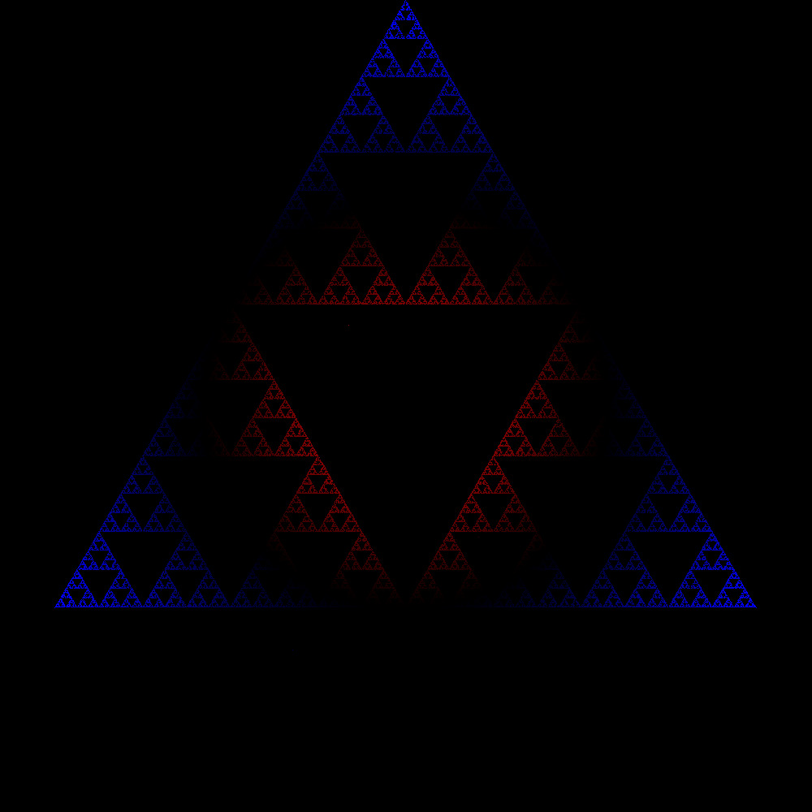

# Chaos Game
## Overview
The Chaos Game is a project designed to visualize the beauty of chaotic systems in computer graphics. This concept is inspired by the [Chaos Game on Wikipedia](https://en.wikipedia.org/wiki/Chaos_game), and it is part of my coursework for CS2337.501.

## Usage
The user will be prompted to enter various parameters for the experiments, such as grid size, polygon sides, iteration count, and more. Then it will allow to create a ppm file based in the data collected after running the chaotical algorithm.

### Experiments
1. Simple Polygon
2. Time Taken to Reach a Point
3. Distance to Center
4. Tracing Path

## Experiment Images
Each image's name provides information about the polygon used, whether vertices are repeated, the type of experiment, the percentage used for displacement, and the number of iterations. Some information might be excluded if not relevant to the experiment.

### Pentagon Experiments
- **Pentagon No-Repeat Distance 60% 100k**
  
  - **Polygon:** Pentagon
  - **Repeats Vertices:** Yes
  - **Experiment:** Distance to Center
  - **Displacement:** 60%
  - **Iterations:** 100k

### Square Experiments
- **Square Simple 100k**
  
  - **Polygon:** Square
  - **Repeats Vertices:** Yes
  - **Experiment:** Simple (Assuming simple is an experiment type)
  - **Iterations:** 100k

- **Square Time 66 1M**
  
  - **Polygon:** Square
  - **Repeats Vertices:** No
  - **Experiment:** Time Taken to Reach a Point
  - **Displacement:** 66% (If applicable)
  - **Iterations:** 1M

### Triangle Experiments
- **Triangle Distance 50% 100k**
  
  - **Polygon:** Triangle
  - **Repeats Vertices:** Yes
  - **Experiment:** Distance to Center
  - **Displacement:** 50%
  - **Iterations:** 100k

- **Triangle Trace 1k**
  
  - **Polygon:** Triangle
  - **Repeats Vertices:** Yes
  - **Experiment:** Tracing Path
  - **Iterations:** 1k

